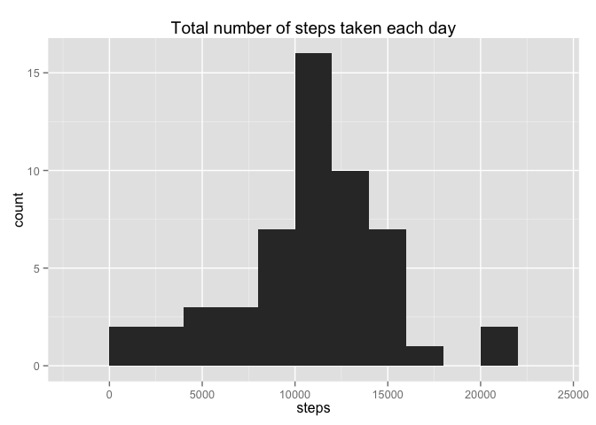
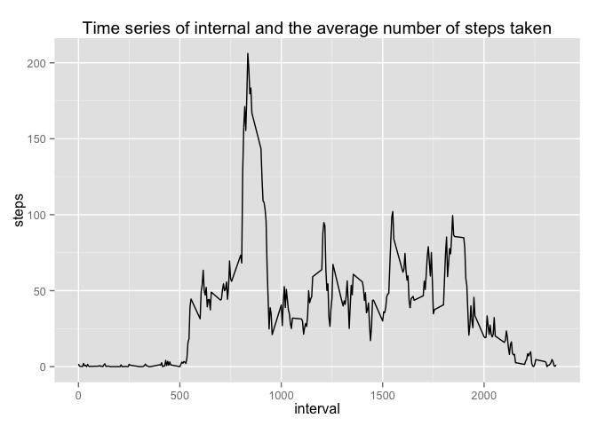
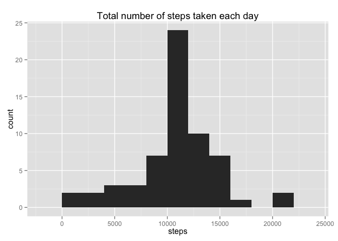
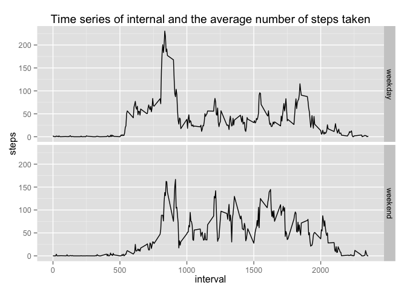

# Reproducible Research: Peer Assessment 1


## Loading and preprocessing the data


```r
# Load the data
activity_data <- read.csv(unz("activity.zip", "activity.csv"))
```


## What is mean total number of steps taken per day?


```r
# Make a histogram of the total number of steps taken each day
total_per_day = aggregate(steps ~ date, activity_data, sum)    # number of steps per day
require(ggplot2)
qplot(steps, data = total_per_day, main = "Total number of steps taken each day", binwidth = 2000)
```

 

```r
# Calculate and report the mean and median total number of steps taken per day
mean(total_per_day$steps)
```

```
## [1] 10766.19
```

```r
median(total_per_day$steps)
```

```
## [1] 10765
```

**Report**: mean is 10766.19 and median is 10765.


## What is the average daily activity pattern?


```r
# Make a time series plot of the 5-minute interval (x-axis) and the average number of steps taken, averaged across all days (y-axis)
step_data = aggregate(steps ~ interval, activity_data, mean)
qplot(interval, steps, data = step_data, geom = c("line"), main = "Time series of internal and the average number of steps taken")
```

 

```r
# Which 5-minute interval, on average across all the days in the dataset, contains the maximum number of steps?
step_data[which.max(step_data$steps), ]$interval
```

```
## [1] 835
```

**Report**: the 835th interval contains the maximum number of steps.

## Imputing missing values


```r
# Calculate and report the total number of missing values in the dataset (i.e. the total number of rows with NAs)
sum(is.na(activity_data))
```

```
## [1] 2304
```

```r
# Filling missing values with the mean for that 5-minute interval
complete_data <- cbind(activity_data, step_data[, 2])
colnames(complete_data)[4] <- "avgSteps"
complete_data[is.na(complete_data), ]$steps <- complete_data[is.na(complete_data), ]$avgSteps

# Create a new dataset that is equal to the original dataset but with the missing data filled in.
complete_data <- complete_data[, 1:3]

# Make a histogram of the total number of steps taken each day and Calculate and report the mean and median total number of steps taken per day. Do these values differ from the estimates from the first part of the assignment? What is the impact of imputing missing data on the estimates of the total daily number of steps?
total_per_day_filled <- aggregate(steps ~ date, complete_data, sum)
qplot(total_per_day_filled$steps, main = "Total number of steps taken each day", xlab = "steps", binwidth = 2000)
```

 

```r
mean(total_per_day_filled$steps)
```

```
## [1] 10766.19
```

```r
median(total_per_day_filled$steps)
```

```
## [1] 10766.19
```

**Report**: There are totally 2304 missing values in the dataset. I filled in the missing values with the mean for that 5-minute interval. After filling in the missing values, the mean remains the same (10766.19) but the median change from 10765 to 10766.19. Imputing missing values surely has impact on the estimates of the total daily numbers of steps, and different imputing methods will lead to different results.

## Are there differences in activity patterns between weekdays and weekends?

```r
# Create a new factor variable in the dataset with two levels -- "weekday" and "weekend" indicating whether a given date is a weekday or weekend day
complete_data$day <- weekdays(as.Date(complete_data$date))
weekdays <- c('Monday', 'Tuesday', 'Wednesday', 'Thursday', 'Friday')
complete_data$day <- factor(ifelse(complete_data$day %in% weekdays, "weekday", "weekend"))

# Make a panel plot containing a time series plot (i.e. type = "l") of the 5-minute interval (x-axis) and the average number of steps taken, averaged across all weekday days or weekend days (y-axis).
step_data_filled <- aggregate(steps ~ interval + day, complete_data, mean)
qplot(interval, steps, data = step_data_filled, facets = day~., geom = c("line"), main = "Time series of internal and the average number of steps taken")
```

 
